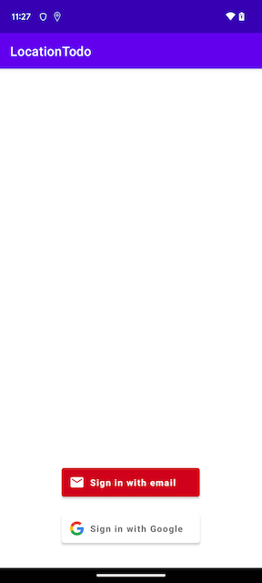

# LocationTodo App

## Getting Started

You should be able to run this app from within Android Studio using Android Gradle Plugin version 8.4.0, Gradle version 8.6,
and Java version 17

### Dependencies

This project uses the following dependencies:
- AndroidX core
- AndroidX appcompat
- AndroidX swipe refresh layout
- AndroidX activity
- AndroidX fragment
- AndroidX lifecycle (extensions, livedata, viewmodel)
- AndroidX constraintLayout
- AndroidX preference
- Google Material
- AndroidX navigation (fragment, ui)
- Koin
- Google Play (location, maps)
- Firebase (uiAuth, auth)
- JUnit
- AndroidX test (core, ext.junit, rules, fragment, archCore)
- KotlinX test (coroutines
- Mockito
- Robolectric
- Google Truth
- Espresso (core, contrib, intents, idlingResources)
- Dexmaker
- AndroidX Annotatioln

## Project Instructions

Running this app will launch the login screen. Clicking the "LOGIN" button navigates the user to the Login Chooser screen, which allows you to choose either email or Google as a login method.
Clicking the email option launches a dialog that allows you to pick an email that is on your device or enter a different one. If you wish to enter a new email you will go through a flow
that asks the user to enter an email, a name, and a password. Clicking the Google option launches a dialog that allows you to pick one of the Google accounts that are on your device.

Once you are logged in with a new account, you are on a screen that shows a list of your reminders. At first, this list is empty. To add a reminder, click the "+" button. 

On the next screen you can enter a title, a description, and click "Reminder Location" to add a location to associate with your reminder. When you click this button you are presented with 
permissions dialog screens for fine location access as well as background location access (only if you are running Android 10 or later). There is additional logic that handles devices that 
are running Android 11 or later.

When you click "Save Reminder" the reminder is added to the database using Room. The List Screen loads this (and any other) reminder into the RecyclerView. Clicking on that item in
the RecyclerView navigates to the Detail Screen, which displays all of the fields associated with this reminder. A geofence is also created after that reminder is added to the database.

Once your foreground and background location permissions are set and a reminder is created with a geofence you will be able to get a notification once you enter the circle radius of that
geofence. This notification reminds you that you have a todo item at the location you are at, allowing you to get things done as you travel through your town or city. 
Make aure that you have your notification settings on for the app to get the notification. Clicking the notification navigates you to the Detail Screen.

